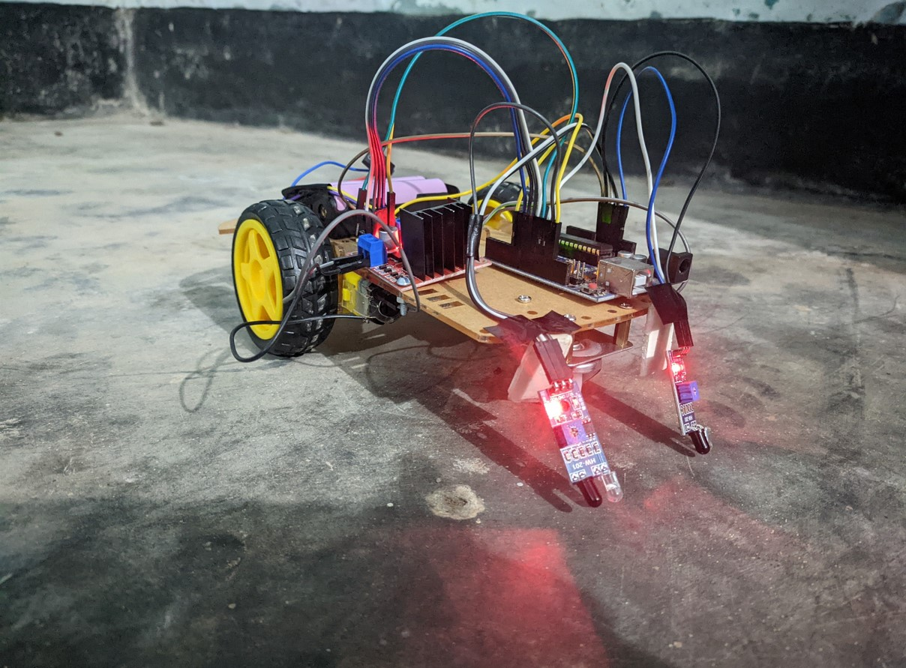
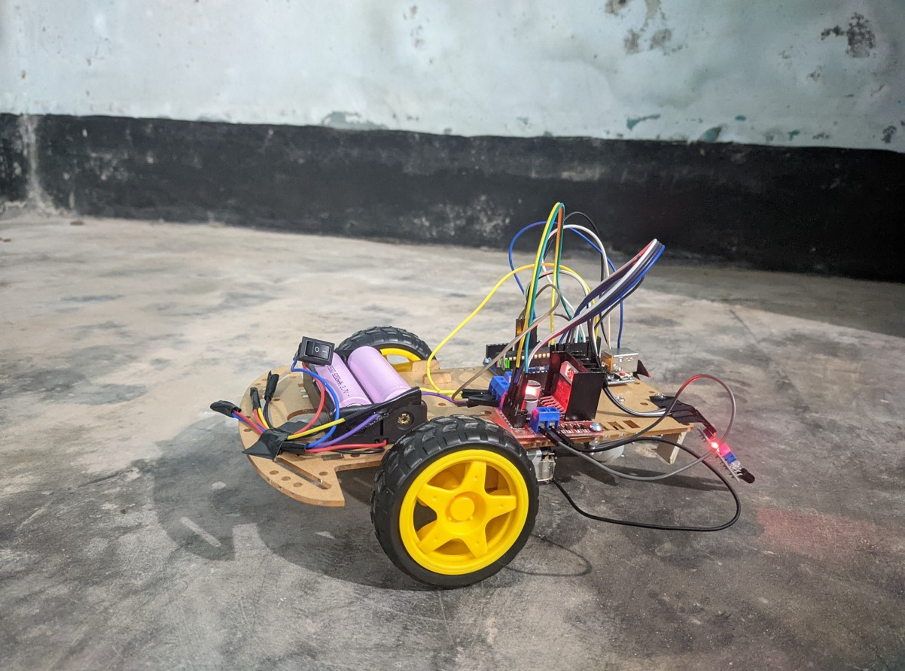
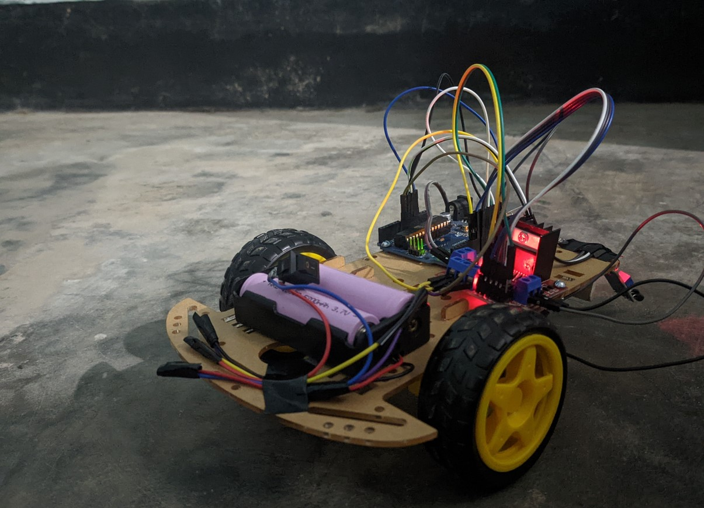
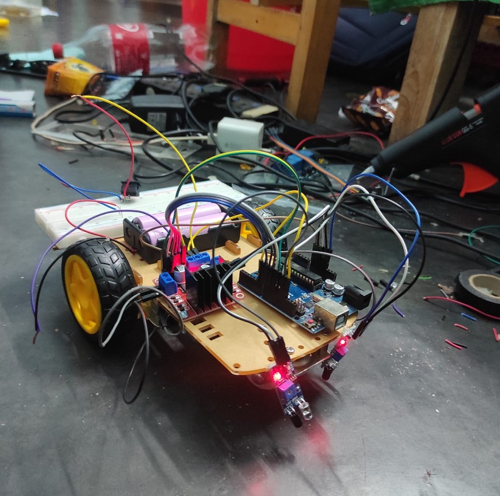

# Line Follower Robot

**SOURCE CODE FOR ARDUINO** 
* controller.ino (Line-Follower Robot)

**Hardware Challenge for Robotics** 
Acquire Some Hardware and Describe It

Components-
* 1 transparent chassis of plastic
* 4 motors
* 4 wheels
* L298N motor driver board 
* ARDUINO UNO
* 5 TCRT5000 infrared tubs
* 5 LEDs
* 5 resistors
* 1 mini protoboard
* 2 battery boxes
* 3 batteries
* 1 USB cable for Arduino
* Cables, screws and bolts

The main difficulty was lowering the speed, solved by adding a dummy circuit to reduce current flow.

